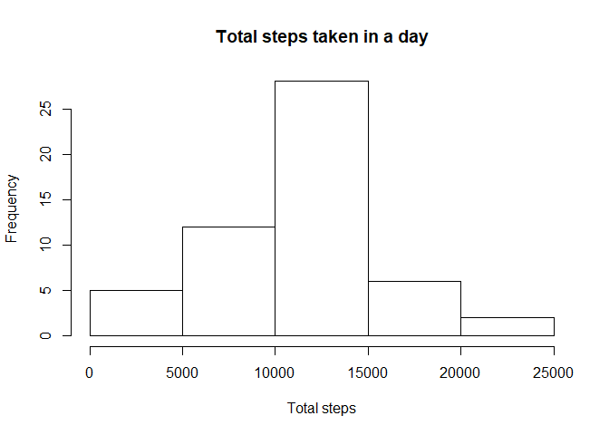
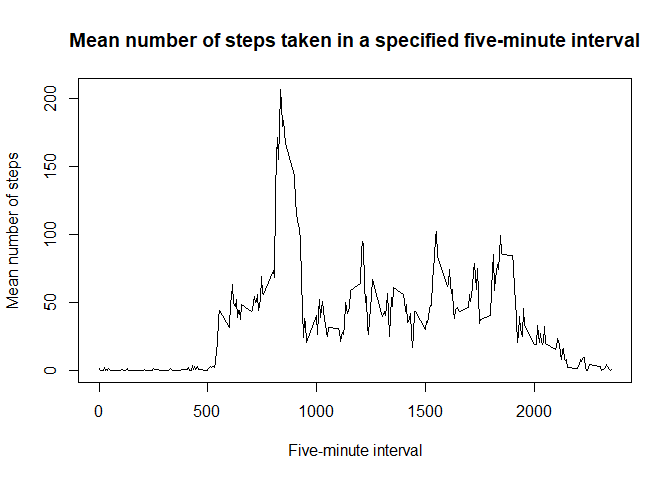
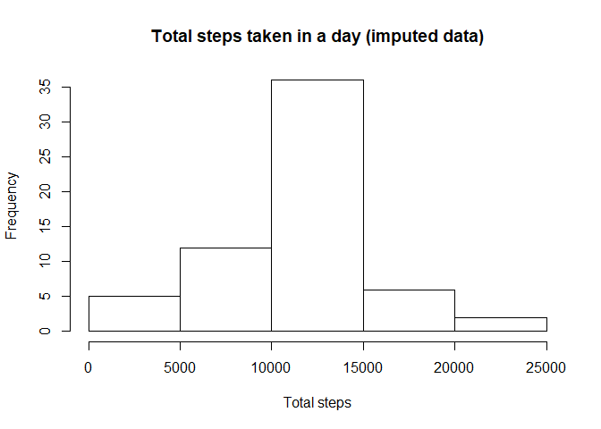
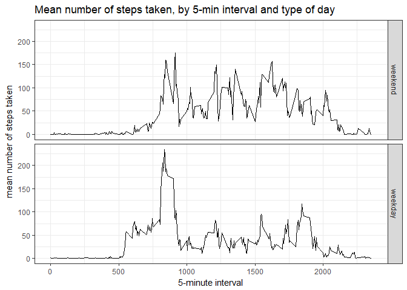

# Reproducible Research: Peer Assessment 1


## Loading and preprocessing the data

First we will load the data into R. The data is stored in a CSV file within a ZIP file. We will unzip the file using `unz()`, and the read the CSV file into the object "data" using `read.table()`.


```r
data <- read.table(unz("activity.zip", "activity.csv"),
                 sep = ",", header = TRUE, na.strings = "NA")
```


Next we will determine if we need to process/transform the data into a format suitable for our analysis. We can use `str()` to see the structure of the data.


```r
str(data)
```

```
## 'data.frame':	17568 obs. of  3 variables:
##  $ steps   : int  NA NA NA NA NA NA NA NA NA NA ...
##  $ date    : Factor w/ 61 levels "2012-10-01","2012-10-02",..: 1 1 1 1 1 1 1 1 1 1 ...
##  $ interval: int  0 5 10 15 20 25 30 35 40 45 ...
```

After doing so, we see that there are 17,568 observations in this dataset, and the variables included in this dataset are:

* *steps*: Number of steps, stored as an integer, taking in a 5-minute interval (missing values are coded as NA);

* *date*: The date, stored as a factor, on which the measurement was taken in YYYY-MM-DD format;

* *interval*: An identifier, stored as an integer, for the 5-minute interval in which measurement was taken.

Our analysis may go more smoothly if we store the *date* variable as a date specifically, rather than a generic factor variable. We can change it to a date variable using `as.Date()`.


```r
data$date <- as.Date(data$date, format = "%Y-%m-%d")
```


## What is mean total number of steps taken per day?

For this section of analysis, we need to total the number of steps taken on each specific date, which we will calculate by using the `aggregate()` command to call the `sum()` function on the _steps_ variable, grouped by the _date_ variable from the original dataframe "data".  We will save the result in a new dataframe called "aggDate", wherein the variable _totSteps_ gives the total number of steps taken on a specified date.


```r
aggDate <- aggregate(list(totSteps = data$steps), 
                   by = list(date = data$date), FUN=sum)
```

Next we will use `hist()` to plot a histogram of the total number of steps taken each day. We will not plot NAs.


```r
hist(aggDate$totSteps, 
     xlab = "Total steps", main = "Total steps taken in a day")
```

<!-- -->

As a last step for this section of the analysis, we will use the `mean()` and `median()` commands to calculate and report the mean and median total number of steps taken per day, which we can see to be **10766.19** steps and **10765** steps, respectively.


```r
mean(aggDate$totSteps, na.rm = TRUE)
```

```
## [1] 10766.19
```

```r
median(aggDate$totSteps, na.rm = TRUE)
```

```
## [1] 10765
```


## What is the average daily activity pattern?

For this section of analysis, we need the mean number of steps taken in each interval, which we will calculate by using the `aggregate()` command to call the `mean()` function on the _steps_ variable, grouped by the _interval_ variable from the original dataframe "data".  We will save the result in a new dataframe called "aggInt", wherein the variable _meanSteps_ gives the average number of steps taken within a specified interval across all days.


```r
aggInt <- aggregate(list(meanSteps = data$steps), 
                   by = list(interval = data$interval), FUN=mean, na.rm=TRUE)
```

Next, we will use `plot()` to construct a time series chart of the 5-minute interval versus the average number of steps taken across all days.


```r
plot(x = aggInt$interval, y = aggInt$meanSteps, type = "l",
     xlab = "Five-minute interval", ylab = "Mean number of steps",
     main = "Mean number of steps taken in a specified five-minute interval")
```

<!-- -->

Finally, we want to dertermine which 5-minute interval, on average across all the days in the dataset, contains the maximum number of steps. To do so, we subset the "aggInt" dataset---using the `which()` command---include only the row from that dataset with largest value of the *meanSteps* variable, which is idenitifed using the `max()` command. We then print this subsetted dataframe (named "maxInt"). The *interval* column identifies the **835th** 5-minute interval as containing the maximum number of steps, averaged across all days. In that interval, an average of 206.17 steps are taken.


```r
maxInt <- aggInt[ which(aggInt$meanSteps == max(aggInt$meanSteps)), ]
print(maxInt)
```

```
##     interval meanSteps
## 104      835  206.1698
```


## Imputing missing values

The presence of missing data (NAs) may introduce bias into calculations or summaries of the data. TO calculate and report the total number of missing values in the *steps* variable (which is also the total number of rows with NAs, as that is the only variable that has them), we use the `sum()` and `is.na()` commands.


```r
sum(is.na(data$steps))
```

```
## [1] 2304
```

Next we want to fill in all of the missing values (NAs) in our dataset. We'll replace NAs with the mean number of steps taken in given 5-minute interval (calcualte across all dates).

To do this, first we'll create new dataset "dataImpute" that starts off equal to the original dataset "data", but which we'll populate with imputed data.

Second, we'll use a combination of the `ave()`, `replace()`, `is.na()`, and `mean()` functions to identify NAs and replace them with the average number of steps taken in a given interval. The first two arguments in the `ave()` function specify that we'll be performing a function (which we later specify as `mean()`) on the *steps* variable from the original "data" dataset, grouped by the *interval* varaible from the original "data" dataset.


```r
dataImpute <- data

dataImpute$steps <- ave(data$steps, data$interval,
    FUN = function(x) replace(x, is.na(x), mean(x, na.rm = TRUE)))
```

To make a histogram of the total number of steps taken each day, and to calculate and report the mean and median total number of steps taken per day, we first need to group the imputed data by the *date* variable using `aggregate()` (this is the same process described in an earlier section of the R markdown file).


```r
aggImputeDate <- aggregate(list(totSteps = dataImpute$steps), 
                   by = list(date = dataImpute$date), FUN=sum)

hist(aggImputeDate$totSteps, 
     xlab = "Total steps", main = "Total steps taken in a day (imputed data)")
```

<!-- -->

```r
mean(aggImputeDate$totSteps, na.rm = TRUE)
```

```
## [1] 10766.19
```

```r
median(aggImputeDate$totSteps, na.rm = TRUE)
```

```
## [1] 10766.19
```

Imputing the data produces one important changes in our histogram. The total number of occurences of a given number of total steps taken per day increases, as evidenced in the histogram's y-axis. Because there were many days populated with NAs in the original dataset, there were fewer observations to graph and the y-axis from the original histogram only went from 0 to 25. With the newly imputed data, there are fewer days with NAs and therefor more occassions to graph, so the new histogram's y-axis goes from 0 to 35 occurnces. The overall pattern expressed in the histogram, however, remains unchanged.

Similarly, there are not any significant substantive changes in our summary statistics. The mean number of steps taken daily reamains the same, which is expected as we used the 5-minute interval mean to impute missing data. The median is slightly raised (though not in a substantively significant way), and it has a decimal. The original median did not have a decimal value because the variable on which we were calculating the median (*totSteps* from "aggDate") was an integer. The new variable on which we're calculating the median (*totSteps* from "aggImputeDate") is not an integer, because the imputed values are means and can therefore have decimal values.


## Are there differences in activity patterns between weekdays and weekends?

First we use `factor()` to create a new factor variable called *weekday* in the dataset with two levels---"weekday" and "weekend"---indicating whether a given date is a weekday or weekend day. To do this, we will use the `isWeekday()` function from the "timeDate" package (which you will need to load with the `library()` function). Note that the factor labels are assigned in the order "weekend" first and "weekday" second. That is because FALSE comes before TRUE alphabetically and will therefore be the first level of the factor, and a FALSE value from the `isWeekDay()` command indicates a weekend.


```r
library(timeDate)
```

```
## Warning: package 'timeDate' was built under R version 3.3.3
```

```r
data$weekday <- factor(isWeekday(data$date, wday=1:5), 
                          labels = c('weekend', 'weekday'))
```

Finally, we want to make a panel plot containing a time series plot of the 5-minute interval (x-axis) and the average number of steps taken, averaged across all weekday days or weekend days (y-axis). 

TO do this, we first need to calculate the mean for steps taken in each 5-minute interval, grouped by the *weekday* variable. We use the `aggregate()` command as before, but instead of just one grouping variable, we specify two grouping variables (*interval* and *weekday*). We save the calculated values in a new dataframe.


```r
aggIntWeekday <- aggregate(list(meanSteps = data$steps), 
                   by = list(interval = data$interval, weekday = data$weekday),
                   FUN=mean, na.rm=TRUE)
```

Finally, we make our plot using the `ggplot()`, `geom_line()`, and `facet_grid()` commands from the "ggplot2" package (which you will need to load with the `library()` function).


```r
library("ggplot2")
g <- ggplot(aggIntWeekday, aes(interval, meanSteps))
g + geom_line() + theme_bw() +
  facet_grid(weekday ~ .) +
  xlab("5-minute interval") + ylab("mean number of steps taken") + 
  ggtitle("Mean number of steps taken, by 5-min interval and type of day")
```

<!-- -->

From these graphs, we can see that the maximum number of steps in any one 5-minute interval is greatest on weekdays (i.e., the average maximum number of steps in any interval is greater on weekdays than on weekends), and that a significant number of steps are taken earlier on weekdays compared to weekends (i.e., people get moving earlier on weekdays), but we also see that the subject takes more steps in more 5-minute intervals on weekends than on weekdays (i.e., the subject is relatively sedentary during much of a weekday compared to weekends).
